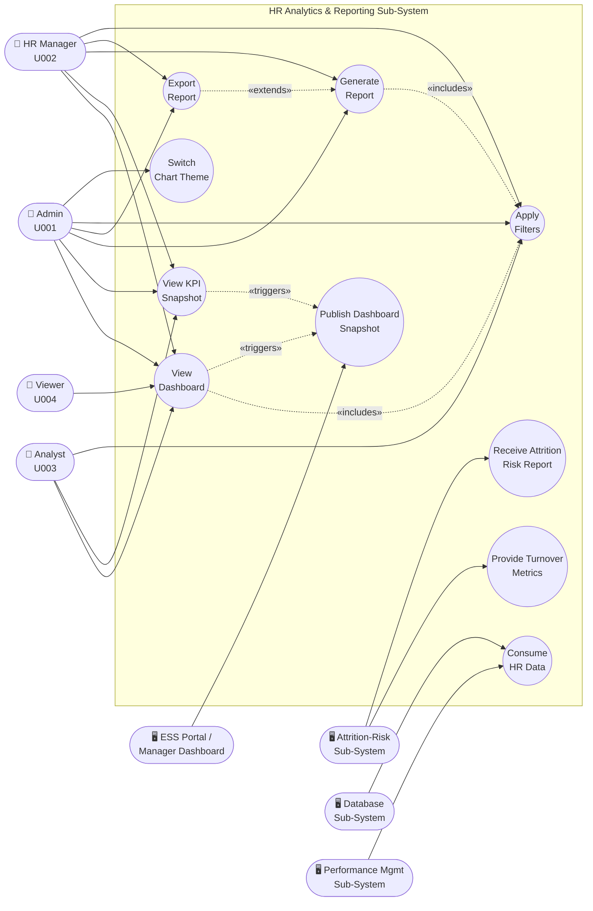
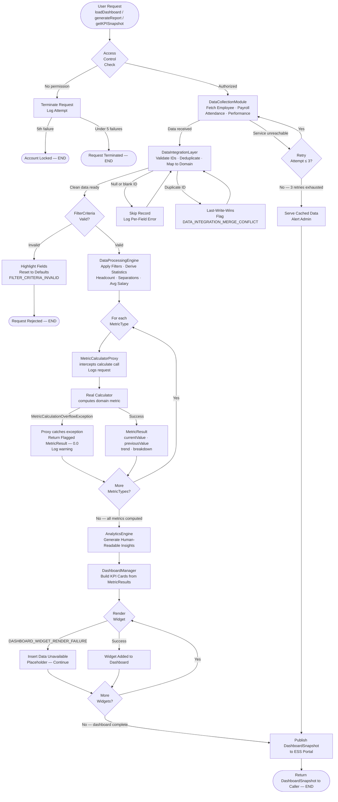
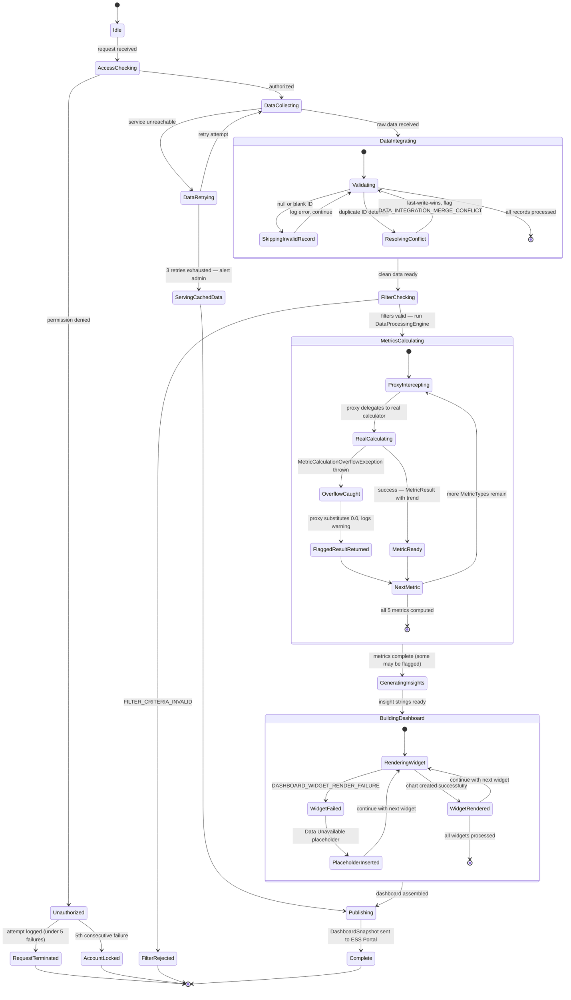

# HR Analytics & Reporting Sub-System — UML Diagrams

---

## 1. Use Case Diagram

```mermaid
flowchart LR
    %% ── Internal actors ──────────────────────────────────────
    Admin(["👤 Admin\nU001"])
    HRMgr(["👤 HR Manager\nU002"])
    Analyst(["👤 Analyst\nU003"])
    Viewer(["👤 Viewer\nU004"])

    %% ── External systems ─────────────────────────────────────
    ESS(["🖥 ESS Portal /\nManager Dashboard"])
    AttrRisk(["🖥 Attrition-Risk\nSub-System"])
    DB(["🖥 Database\nSub-System"])
    PerfMgmt(["🖥 Performance Mgmt\nSub-System"])

    %% ── System boundary ──────────────────────────────────────
    subgraph sys["  HR Analytics & Reporting Sub-System  "]
        direction TB
        UC1((View\nDashboard))
        UC2((View KPI\nSnapshot))
        UC3((Generate\nReport))
        UC4((Export\nReport))
        UC5((Apply\nFilters))
        UC6((Switch\nChart Theme))
        UC7((Publish Dashboard\nSnapshot))
        UC8((Provide Turnover\nMetrics))
        UC9((Receive Attrition\nRisk Report))
        UC10((Consume\nHR Data))
    end

    %% ── Actor associations ───────────────────────────────────
    Admin --> UC1
    Admin --> UC2
    Admin --> UC3
    Admin --> UC4
    Admin --> UC5
    Admin --> UC6
    HRMgr --> UC1
    HRMgr --> UC2
    HRMgr --> UC3
    HRMgr --> UC4
    HRMgr --> UC5
    Analyst --> UC1
    Analyst --> UC2
    Analyst --> UC5
    Viewer --> UC1
    ESS --> UC7
    AttrRisk --> UC8
    AttrRisk --> UC9
    DB --> UC10
    PerfMgmt --> UC10

    %% ── Include / Extend ─────────────────────────────────────
    UC1 -.->|"«includes»"| UC5
    UC3 -.->|"«includes»"| UC5
    UC4 -.->|"«extends»"| UC3
    UC1 -.->|"«triggers»"| UC7
    UC2 -.->|"«triggers»"| UC7
```

---

## 2. Activity Diagram

```mermaid
flowchart TD
    Start([User Request\nloadDashboard / generateReport / getKPISnapshot])

    Start --> AC{Access\nControl\nCheck}

    AC -->|No permission| UNAUTH[Terminate Request\nLog Attempt]
    UNAUTH -->|5th failure| LOCK([Account Locked — END])
    UNAUTH -->|Under 5 failures| END1([Request Terminated — END])

    AC -->|Authorized| COLLECT[DataCollectionModule\nFetch Employee · Payroll\nAttendance · Performance]

    COLLECT -->|Service unreachable| RETRY{Retry\nAttempt ≤ 3?}
    RETRY -->|Yes| COLLECT
    RETRY -->|No — 3 retries exhausted| CACHE[Serve Cached Data\nAlert Admin]

    COLLECT -->|Data received| INTEGRATE[DataIntegrationLayer\nValidate IDs · Deduplicate · Map to Domain]
    INTEGRATE -->|Null or blank ID| SKIP[Skip Record\nLog Per-Field Error]
    SKIP --> INTEGRATE
    INTEGRATE -->|Duplicate ID| CONFLICT[Last-Write-Wins\nFlag DATA_INTEGRATION_MERGE_CONFLICT]
    CONFLICT --> INTEGRATE

    INTEGRATE -->|Clean data ready| FCHECK{FilterCriteria\nValid?}
    FCHECK -->|Invalid| FERR[Highlight Fields\nReset to Defaults\nFILTER_CRITERIA_INVALID]
    FERR --> END2([Request Rejected — END])

    FCHECK -->|Valid| PROCESS[DataProcessingEngine\nApply Filters · Derive Statistics\nHeadcount · Separations · Avg Salary]

    PROCESS --> PROXYSTART{For each\nMetricType}
    PROXYSTART --> PROXY[MetricCalculatorProxy\nintercepts calculate call\nLogs request]
    PROXY --> REAL[Real Calculator\ncomputes domain metric]
    REAL -->|MetricCalculationOverflowException| FLAGGED[Proxy catches exception\nReturn Flagged MetricResult — 0.0\nLog warning]
    REAL -->|Success| RESULT[MetricResult\ncurrentValue · previousValue\ntrend · breakdown]
    FLAGGED --> NEXTM{More\nMetricTypes?}
    RESULT --> NEXTM
    NEXTM -->|Yes| PROXYSTART
    NEXTM -->|No — all metrics computed| ANALYTICS[AnalyticsEngine\nGenerate Human-Readable Insights]

    ANALYTICS --> BUILD[DashboardManager\nBuild KPI Cards from MetricResults]
    BUILD --> WIDGET{Render\nWidget}
    WIDGET -->|DASHBOARD_WIDGET_RENDER_FAILURE| HOLDER[Insert Data Unavailable\nPlaceholder — Continue]
    WIDGET -->|Success| WDONE[Widget Added to Dashboard]
    HOLDER --> MOREW{More\nWidgets?}
    WDONE --> MOREW
    MOREW -->|Yes| WIDGET
    MOREW -->|No — dashboard complete| PUBLISH[Publish DashboardSnapshot\nto ESS Portal]

    CACHE --> PUBLISH
    PUBLISH --> RETURN([Return DashboardSnapshot to Caller — END])
```

---

## 3. Class Diagram

```mermaid
classDiagram
    %% ══════════════════════════════════════════════
    %%  FACADE PATTERN
    %% ══════════════════════════════════════════════

    class HRAnalyticsService {
        <<interface>>
        +loadDashboard(userId, filters) DashboardSnapshot
        +generateReport(type, filters) ReportSummary
        +exportReport(reportId, format) String
        +getKPISnapshot(userId, deptId) List~KPISnapshot~
    }

    class HRAnalyticsFacade {
        -accessControl : AccessControlModule
        -dataCollection : DataCollectionModule
        -dataIntegration : DataIntegrationLayer
        -dataProcessing : DataProcessingEngine
        -metricsEngine : MetricsCalculationEngine
        -analyticsEngine : AnalyticsEngine
        -dashboardManager : DashboardManager
        -reportGenerator : ReportGenerator
        -exportModule : ExportSharingModule
        +loadDashboard(userId, filters) DashboardSnapshot
        +generateReport(type, filters) ReportSummary
        +exportReport(reportId, format) String
        +getKPISnapshot(userId, deptId) List~KPISnapshot~
    }

    HRAnalyticsFacade ..|> HRAnalyticsService : implements

    %% ══════════════════════════════════════════════
    %%  PROXY PATTERN
    %% ══════════════════════════════════════════════

    class MetricCalculator {
        <<interface>>
        +calculate(data ProcessedData) MetricResult
        +getMetricType() MetricType
        +getMetricName() String
        +getUnit() String
    }

    class MetricCalculatorProxy {
        -real : MetricCalculator
        +calculate(data ProcessedData) MetricResult
        +getMetricType() MetricType
        +getMetricName() String
        +getUnit() String
    }

    class AttritionRateCalculator {
        +calculate(data ProcessedData) MetricResult
        +getMetricType() MetricType
        +getMetricName() String
        +getUnit() String
    }

    class EmployeeGrowthCalculator {
        +calculate(data ProcessedData) MetricResult
        +getMetricType() MetricType
        +getMetricName() String
        +getUnit() String
    }

    class AveragePerformanceCalculator {
        +calculate(data ProcessedData) MetricResult
        +getMetricType() MetricType
        +getMetricName() String
        +getUnit() String
    }

    class DepartmentMetricsCalculator {
        +calculate(data ProcessedData) MetricResult
        +getMetricType() MetricType
        +getMetricName() String
        +getUnit() String
    }

    class CompensationAnalyticsCalculator {
        +calculate(data ProcessedData) MetricResult
        +getMetricType() MetricType
        +getMetricName() String
        +getUnit() String
    }

    MetricCalculatorProxy ..|> MetricCalculator : implements
    MetricCalculatorProxy o-- MetricCalculator : wraps real subject
    AttritionRateCalculator ..|> MetricCalculator : implements
    EmployeeGrowthCalculator ..|> MetricCalculator : implements
    AveragePerformanceCalculator ..|> MetricCalculator : implements
    DepartmentMetricsCalculator ..|> MetricCalculator : implements
    CompensationAnalyticsCalculator ..|> MetricCalculator : implements

    class MetricResult {
        -type : MetricType
        -metricName : String
        -currentValue : double
        -previousValue : double
        -trend : String
        -unit : String
        -overflowed : boolean
        -breakdown : Map~String, Double~
        +getCurrentValue() double
        +getTrend() String
        +isOverflowed() boolean
    }

    class MetricType {
        <<enumeration>>
        ATTRITION_RATE
        EMPLOYEE_GROWTH
        AVERAGE_PERFORMANCE
        DEPARTMENT_METRICS
        COMPENSATION_ANALYTICS
    }

    class MetricsCalculationEngine {
        -calculators : Map~MetricType, MetricCalculator~
        +calculate(type, data) MetricResult
        +calculateAll(data) Map~MetricType, MetricResult~
        +registerCalculator(calculator) void
    }

    MetricsCalculationEngine o-- MetricCalculator : holds as proxy
    MetricCalculatorProxy --> MetricResult : returns

    %% ══════════════════════════════════════════════
    %%  ABSTRACT FACTORY PATTERN
    %% ══════════════════════════════════════════════

    class ChartFactory {
        <<interface>>
        +createLineChart(result MetricResult) LineChart
        +createBarChart(result MetricResult) BarChart
        +createPieChart(result MetricResult) PieChart
    }

    class EmployeeGrowthChartFactory {
        +createLineChart(result MetricResult) LineChart
        +createBarChart(result MetricResult) BarChart
        +createPieChart(result MetricResult) PieChart
    }

    class AttritionChartFactory {
        +createLineChart(result MetricResult) LineChart
        +createBarChart(result MetricResult) BarChart
        +createPieChart(result MetricResult) PieChart
    }

    class CompensationChartFactory {
        +createLineChart(result MetricResult) LineChart
        +createBarChart(result MetricResult) BarChart
        +createPieChart(result MetricResult) PieChart
    }

    class Chart {
        <<abstract>>
        #title : String
        #dataPoints : List~Double~
        #color : String
        +render() String
    }

    class LineChart {
        +render() String
    }

    class BarChart {
        +render() String
    }

    class PieChart {
        +render() String
    }

    EmployeeGrowthChartFactory ..|> ChartFactory : implements
    AttritionChartFactory ..|> ChartFactory : implements
    CompensationChartFactory ..|> ChartFactory : implements
    LineChart --|> Chart : extends
    BarChart --|> Chart : extends
    PieChart --|> Chart : extends

    %% ══════════════════════════════════════════════
    %%  DASHBOARD
    %% ══════════════════════════════════════════════

    class DashboardManager {
        -chartFactory : ChartFactory
        +buildDashboard(userId, filters, metrics, insights) Dashboard
    }

    class Dashboard {
        -dashboardId : String
        -kpiCards : List~KPICard~
        -widgets : List~Widget~
        -insights : List~String~
        +getDashboardId() String
        +getKpiCards() List~KPICard~
        +getWidgets() List~Widget~
    }

    class KPICard {
        -metricName : String
        -currentValue : double
        -previousValue : double
        -trend : String
        -unit : String
        -flagged : boolean
    }

    class Widget {
        -widgetId : String
        -chart : Chart
        -placeholder : boolean
        +isPlaceholder() boolean
    }

    DashboardManager o-- ChartFactory : uses
    DashboardManager --> Dashboard : creates
    Dashboard *-- KPICard : contains
    Dashboard *-- Widget : contains
    Widget o-- Chart : renders

    %% ══════════════════════════════════════════════
    %%  REPORT & EXPORT
    %% ══════════════════════════════════════════════

    class ReportType {
        <<enumeration>>
        ATTRITION
        EMPLOYEE_GROWTH
        COMPENSATION
        DEPARTMENT_METRICS
        PERFORMANCE
        FULL_HR_SUMMARY
    }

    class Report {
        -reportId : String
        -reportTitle : String
        -type : ReportType
        -generatedDate : String
        -reportSections : List~Map~
        +getReportId() String
        +getReportTitle() String
    }

    class ReportGenerator {
        +generate(type, dashboard, metrics, filters) Report
    }

    class ExportFormat {
        <<abstract>>
        +export(report Report) String
        +getFileType() String
        #sanitise(name) String
    }

    class CSVExport {
        +export(report Report) String
        +getFileType() String
    }

    class PDFExport {
        +export(report Report) String
        +getFileType() String
    }

    class ExcelExport {
        +export(report Report) String
        +getFileType() String
    }

    class ExportSharingModule {
        -formats : Map~String, ExportFormat~
        +export(report, formatType) String
        +registerFormat(fmt ExportFormat) void
    }

    ReportGenerator --> Report : creates
    CSVExport --|> ExportFormat : extends
    PDFExport --|> ExportFormat : extends
    ExcelExport --|> ExportFormat : extends
    ExportSharingModule o-- ExportFormat : dispatches to

    %% ══════════════════════════════════════════════
    %%  MVC WEB LAYER
    %% ══════════════════════════════════════════════

    class ApiHandler {
        +handle(exchange HttpExchange) void
    }

    class DashboardController {
        -facade : HRAnalyticsService
        +handle(params Map) DashboardSnapshot
    }

    class ReportController {
        -facade : HRAnalyticsService
        +handleGenerate(params Map) ReportSummary
        +handleExport(params Map) String
    }

    class KPIController {
        -facade : HRAnalyticsService
        +handle(params Map) List~KPISnapshot~
    }

    ApiHandler --> DashboardController : routes to
    ApiHandler --> ReportController : routes to
    ApiHandler --> KPIController : routes to
    DashboardController --> HRAnalyticsService : calls
    ReportController --> HRAnalyticsService : calls
    KPIController --> HRAnalyticsService : calls

    %% ══════════════════════════════════════════════
    %%  PIPELINE STAGES
    %% ══════════════════════════════════════════════

    class AccessControlModule {
        -failureCount : Map~String, Integer~
        +authorize(userId, action) void
    }

    class DataCollectionModule {
        -employeeService : EmployeeService
        -payrollService : PayrollService
        -attendanceService : AttendanceService
        -performanceService : PerformanceService
        +collectAll(filters FilterCriteria) RawHRData
    }

    class DataIntegrationLayer {
        +integrate(raw RawHRData) RawHRData
    }

    class DataProcessingEngine {
        +process(raw RawHRData, filters FilterCriteria) ProcessedData
    }

    class AnalyticsEngine {
        +generateInsights(metrics, data) List~String~
    }

    class RawHRData {
        -employees : List~Employee~
        -payrollRecords : List~Payroll~
        -attendanceRecords : List~Attendance~
        -performanceRecords : List~Performance~
    }

    class ProcessedData {
        -employees : List~Employee~
        -totalHeadcount : int
        -previousHeadcount : int
        -separations : int
        -totalGrossSalary : double
        -performanceRecords : List~Performance~
        +getTotalHeadcount() int
        +getSeparations() int
    }

    %% ══════════════════════════════════════════════
    %%  DOMAIN
    %% ══════════════════════════════════════════════

    class Employee {
        -employeeId : String
        -name : String
        -department : String
        -designation : String
        -joinDate : LocalDate
        -baseSalary : double
        -performanceScore : double
        -status : Status
    }

    class FilterCriteria {
        -filterDepartment : List~String~
        -filterStatus : String
        -dateRange : DateRange
        -employeeCategory : String
    }

    %% ══════════════════════════════════════════════
    %%  DTOS
    %% ══════════════════════════════════════════════

    class DashboardSnapshot {
        -dashboardId : String
        -kpiCards : List~KPISnapshot~
        -attritionRate : double
        -employeeGrowth : double
        -avgPerformance : double
        -insights : List~String~
    }

    class KPISnapshot {
        -metricName : String
        -currentValue : double
        -previousValue : double
        -trend : String
        -unit : String
        -flagged : boolean
    }

    class ReportSummary {
        -reportId : String
        -reportTitle : String
        -reportType : String
        -generatedDate : String
        -sectionCount : int
    }

    %% ══════════════════════════════════════════════
    %%  FACADE → PIPELINE DEPENDENCIES
    %% ══════════════════════════════════════════════

    HRAnalyticsFacade --> AccessControlModule : uses
    HRAnalyticsFacade --> DataCollectionModule : uses
    HRAnalyticsFacade --> DataIntegrationLayer : uses
    HRAnalyticsFacade --> DataProcessingEngine : uses
    HRAnalyticsFacade --> MetricsCalculationEngine : uses
    HRAnalyticsFacade --> AnalyticsEngine : uses
    HRAnalyticsFacade --> DashboardManager : uses
    HRAnalyticsFacade --> ReportGenerator : uses
    HRAnalyticsFacade --> ExportSharingModule : uses

    DataCollectionModule --> RawHRData : produces
    DataIntegrationLayer --> RawHRData : cleans
    DataProcessingEngine --> ProcessedData : produces
    RawHRData *-- Employee
```

---

## 4. State Diagram

```mermaid
stateDiagram-v2
    [*] --> Idle

    Idle --> AccessChecking : request received

    AccessChecking --> Unauthorized : permission denied
    AccessChecking --> DataCollecting : authorized

    Unauthorized --> RequestTerminated : attempt logged (under 5 failures)
    Unauthorized --> AccountLocked : 5th consecutive failure

    RequestTerminated --> [*]
    AccountLocked --> [*]

    DataCollecting --> DataRetrying : service unreachable
    DataRetrying --> DataCollecting : retry attempt
    DataRetrying --> ServingCachedData : 3 retries exhausted — alert admin

    DataCollecting --> DataIntegrating : raw data received

    state DataIntegrating {
        [*] --> Validating
        Validating --> SkippingInvalidRecord : null or blank ID
        SkippingInvalidRecord --> Validating : log error, continue
        Validating --> ResolvingConflict : duplicate ID detected
        ResolvingConflict --> Validating : last-write-wins, flag DATA_INTEGRATION_MERGE_CONFLICT
        Validating --> [*] : all records processed
    }

    DataIntegrating --> FilterChecking : clean data ready

    FilterChecking --> FilterRejected : FILTER_CRITERIA_INVALID
    FilterChecking --> MetricsCalculating : filters valid — run DataProcessingEngine

    FilterRejected --> [*]

    state MetricsCalculating {
        [*] --> ProxyIntercepting
        ProxyIntercepting --> RealCalculating : proxy delegates to real calculator
        RealCalculating --> OverflowCaught : MetricCalculationOverflowException thrown
        OverflowCaught --> FlaggedResultReturned : proxy substitutes 0.0, logs warning
        RealCalculating --> MetricReady : success — MetricResult with trend
        FlaggedResultReturned --> NextMetric
        MetricReady --> NextMetric
        NextMetric --> ProxyIntercepting : more MetricTypes remain
        NextMetric --> [*] : all 5 metrics computed
    }

    MetricsCalculating --> GeneratingInsights : metrics complete (some may be flagged)

    GeneratingInsights --> BuildingDashboard : insight strings ready

    state BuildingDashboard {
        [*] --> RenderingWidget
        RenderingWidget --> WidgetFailed : DASHBOARD_WIDGET_RENDER_FAILURE
        WidgetFailed --> PlaceholderInserted : Data Unavailable placeholder
        PlaceholderInserted --> RenderingWidget : continue with next widget
        RenderingWidget --> WidgetRendered : chart created successfully
        WidgetRendered --> RenderingWidget : continue with next widget
        WidgetRendered --> [*] : all widgets processed
    }

    ServingCachedData --> Publishing
    BuildingDashboard --> Publishing : dashboard assembled

    Publishing --> Complete : DashboardSnapshot sent to ESS Portal

    Complete --> [*]
```
